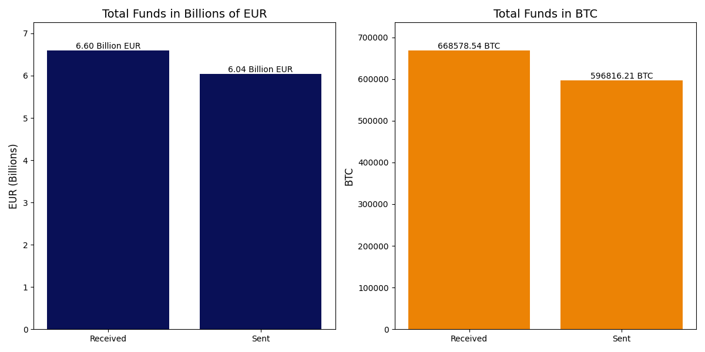
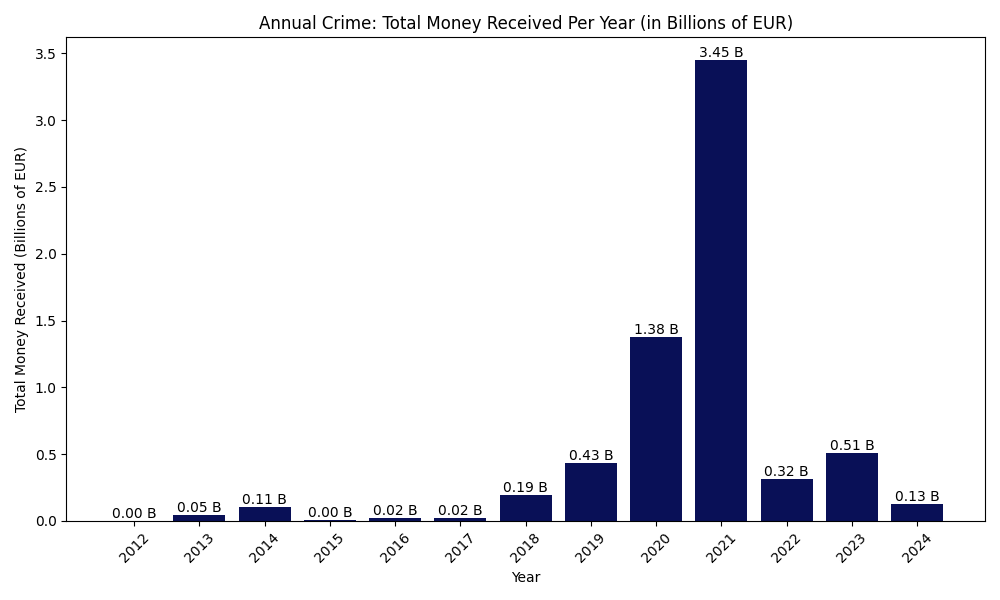
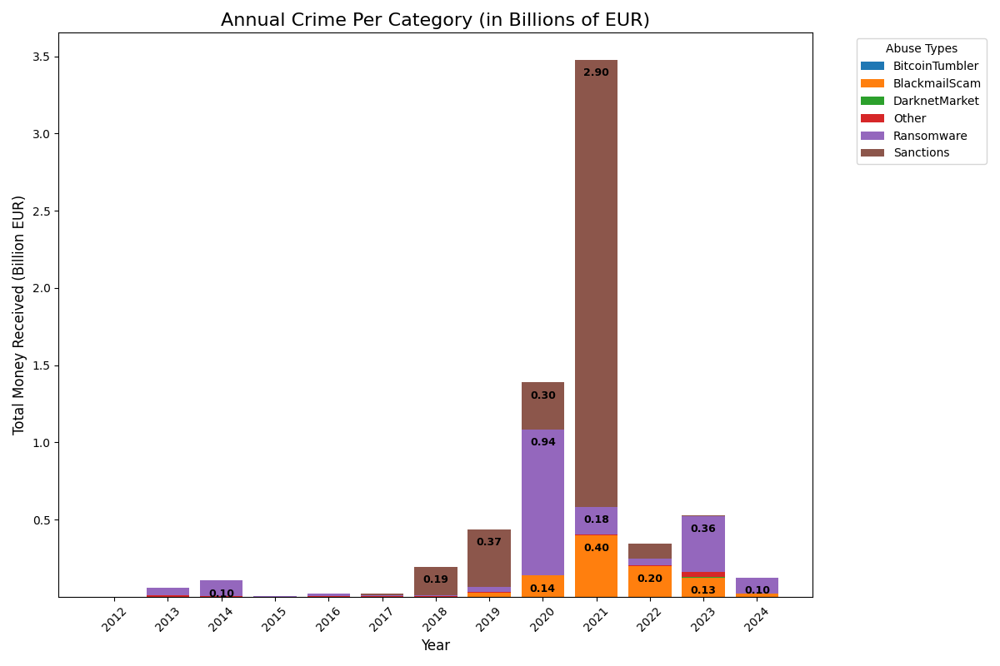
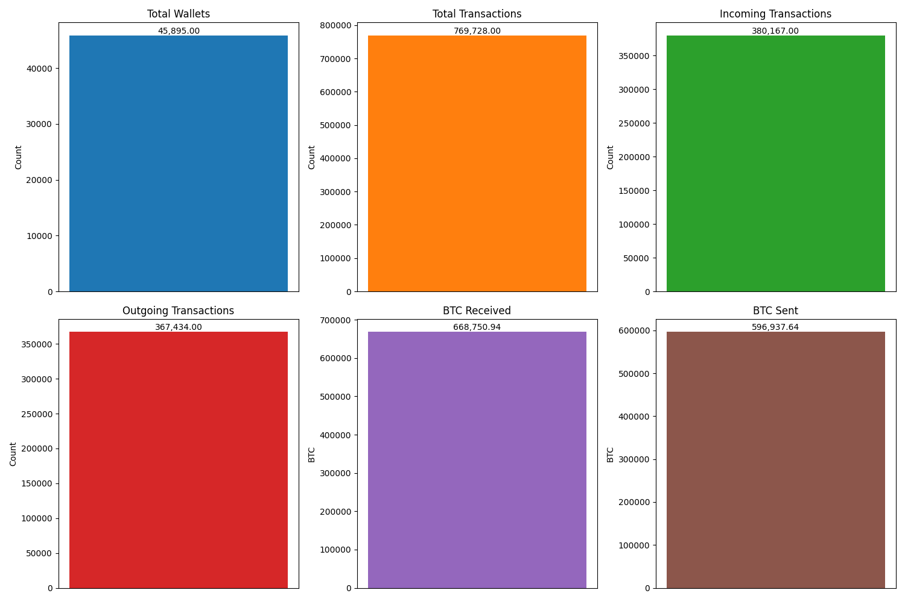
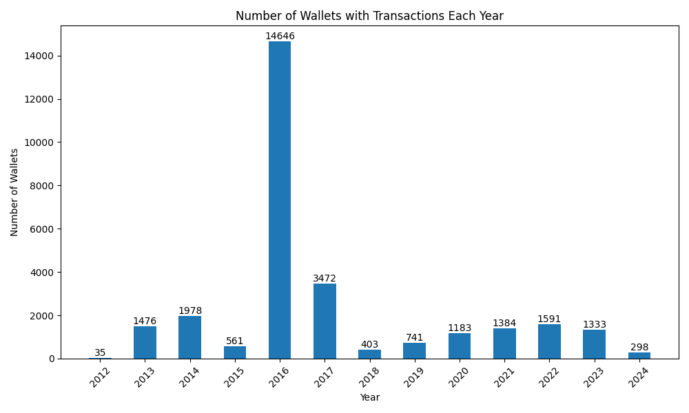
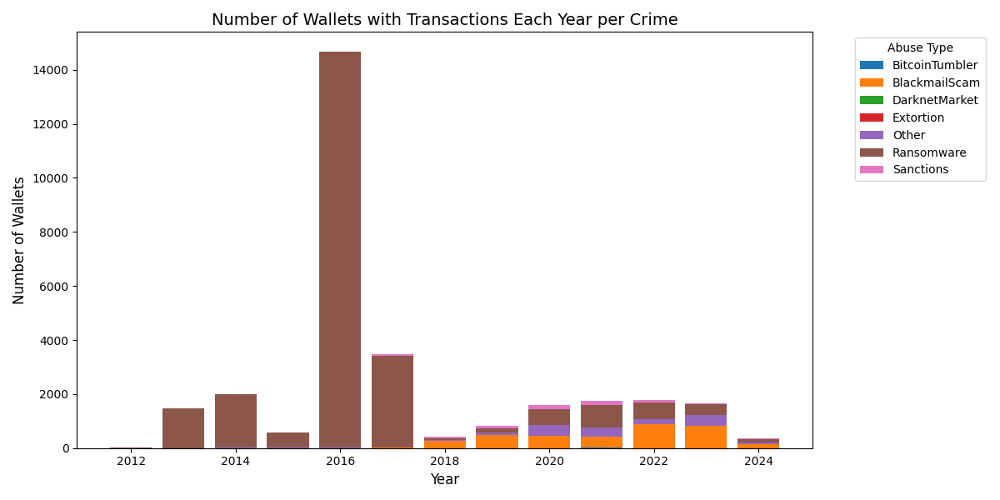
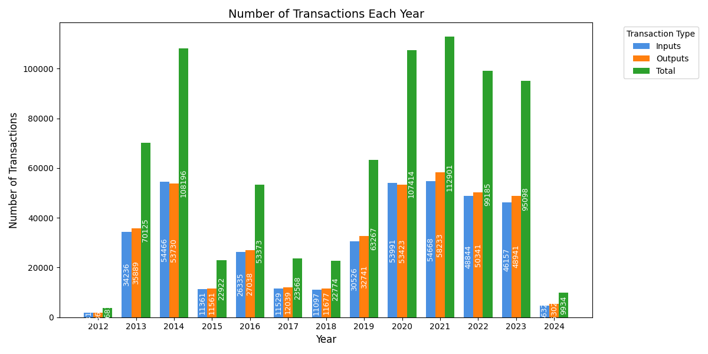
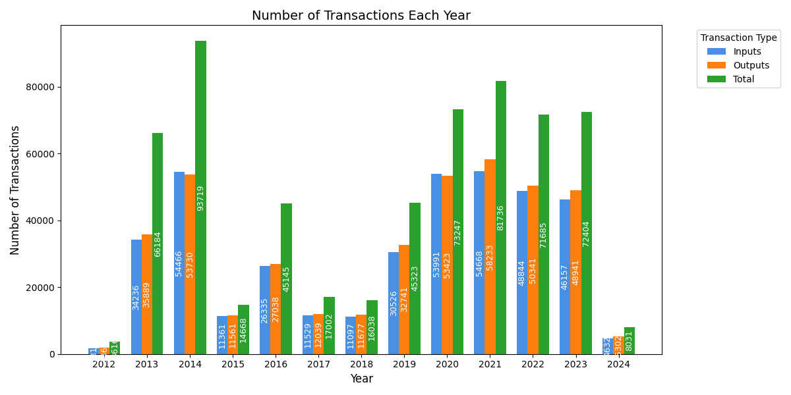
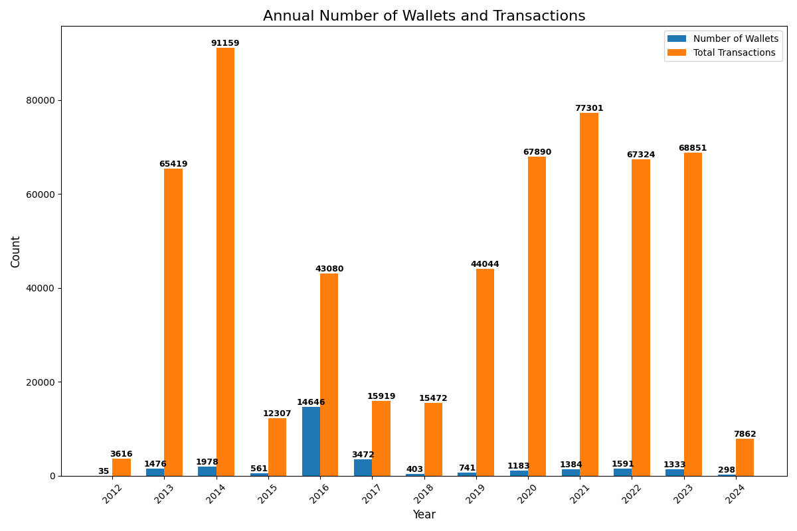

# Cryptoabuse Inssights

## 0. Overall movement of funds  

### #TODO explanation....... 

## 1. Pie chart of total money per abuse type

#TODO graph (fix benign)

### #TODO explanation..........

## 2. Annual crime

### #TODO expanation...........

## 3. Annual crime per category

### #TODO expanation...........

## 4. yoy change in each abuse

#TODO graph.....

### TODO explanation..........

## 5. overall wallets and transactions

### TODO explanation

## 6. wallets that have transaction wach year

### TODO explanation..............

## 7.wallets_that_have_transactions_each_year_per_crime

### TODO explanation..................

## 8. number of transactions each year

### results for counting only one in total for each transation i dont know if this is of any interset discrepency is becasue, If a single transaction has multiple inputs or outputs involving the same wallet, we might count each input and each output individually. However, when counting the total, we only increment once per unique transaction, leading to a situation where the sum of inputs and outputs is greater than the total count.

 

### TODO explanation..................

## 10. Number_of_wallets_and_transactions

## TODO explanation..................

