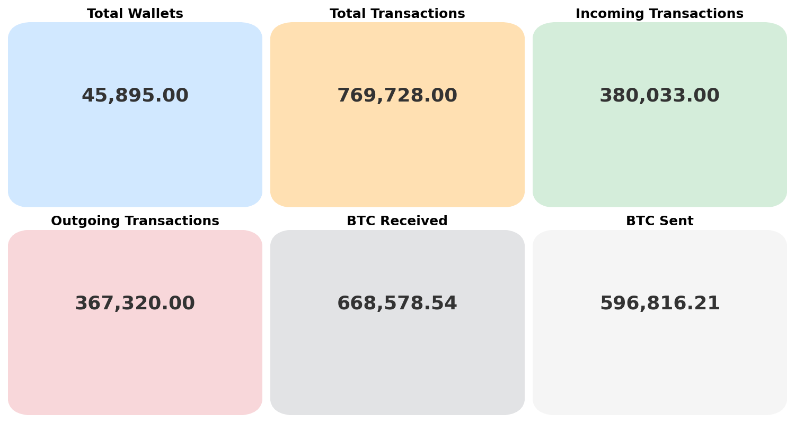

# Cryptoabuse Inssights

## 0. Overall movement of funds  

### #TODO explanation....... 

## 1. Pie chart of total money per abuse type

#TODO graph (fix benign)

### #TODO explanation..........

## 2. Annual crime

### #TODO expanation...........

## 3. Annual crime per category

### #TODO expanation...........

## 4. yoy change in each abuse

#TODO graph.....

### TODO explanation..........

## 5. overall wallets and transactions

### TODO explanation

## 6. wallets that have transaction wach year

### TODO explanation..............